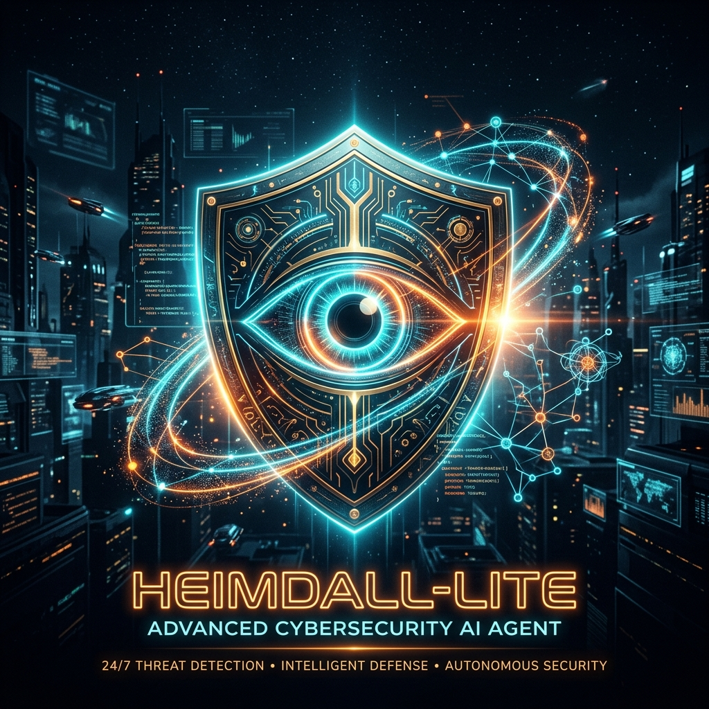
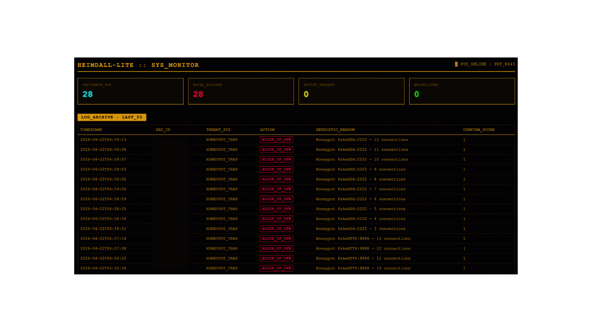
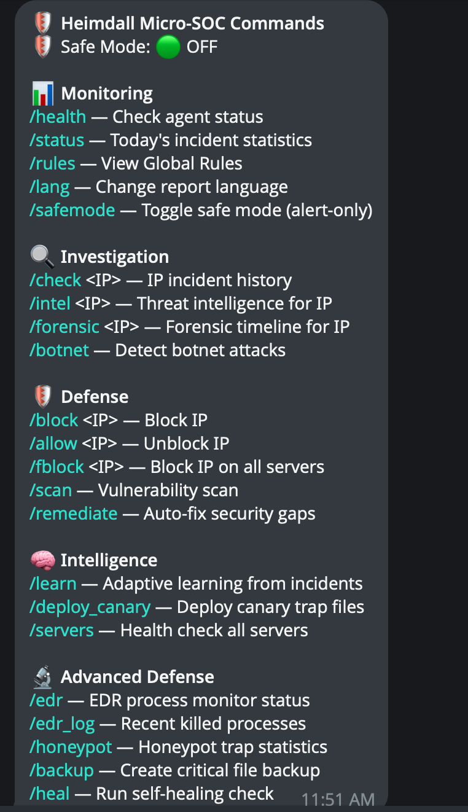
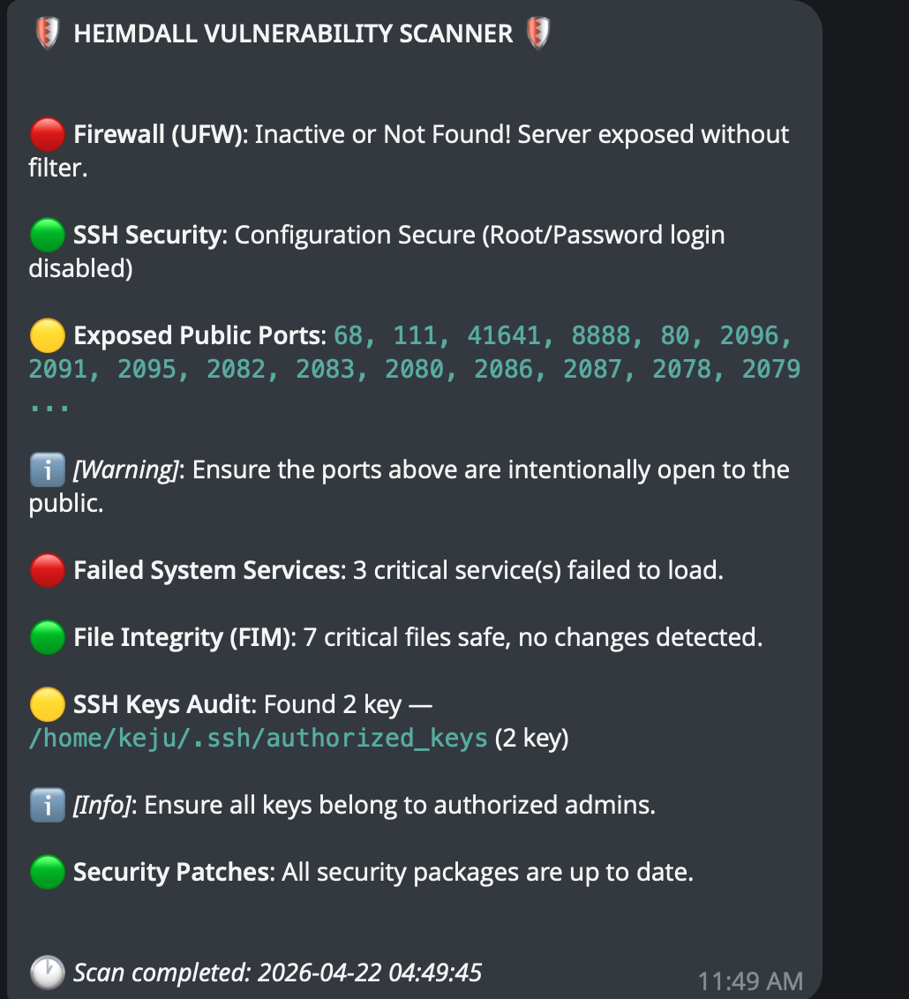

<p align="center">
  
</p>

# Heimdall-Lite: Lightweight Micro-SOC Security Daemon 🛡️

A low-footprint security daemon designed for proactive threat mitigation with minimal compute overhead.

Heimdall-Lite functions as a Layer-2 defense system optimized for low-spec environments operating behind a Cloudflare Tunnel. Instead of passive logging, it actively parses web and auth logs, utilizes remote LLM endpoints for behavioral analysis, and triggers automated firewall/routing responses. Core capabilities include IP clustering for decentralized attacks, automated configuration patching, dynamic malicious signature generation, and decoy (canary) file monitoring.

---

## 🔥 Key Features (Why Heimdall-Lite?)

- **Offloaded LLM Inference:** Sends complex log analysis payloads to a remote **Ollama** API endpoint, keeping the local server CPU footprint near 0%.
- **Deterministic Fallback:** Automatically switches to a strict, regex-based heuristic engine if the LLM endpoint times out or returns malformed data.
- **Safe Mode 🛡️:** A built-in safety net that turns all destructive actions (like blocking IPs, killing processes, or restoring files) into alert-only mode, so new users can safely evaluate the agent without fear of accidentally disrupting their services. Enabled by default.
- **Micro-EDR (Active Process Monitoring) 🦠:** Real-time scanning of `/proc` to instantly detect and SIGKILL malicious reverse shells, webshells, or post-exploitation binaries.
- **Active Deception & Tarpitting 🎭:** Deploys fake SSH (`:2222`) and HTTP (`:8888`) honeypots that intentionally slow down attackers (tarpitting) while secretly logging their payloads and auto-blocking them.
- **Self-Healing & Auto-Rollback 🔄:** Automatically maintains encrypted backups of critical system files (like `sshd_config`, `nginx.conf`). If File Integrity Monitoring (FIM) detects tampering, Heimdall instantly auto-restores the original file and restarts the affected service.
- **3-Layer Memory Architecture:**
  - **Short-Term Memory (STM):** Tracks aggressive activities over the last 30-60 minutes.
  - **Long-Term Memory (LTM):** SQLite database recording incident history, false positives, and whitelists.
  - **Global Memory (GM):** Absolute static rules for zero-latency mitigation.
- **Dynamic Rule Generation 🧠:** Periodically queries the SQLite Long-Term Memory (LTM) to identify recurring malicious patterns and compiles them into static Global Memory (GM) rules.
- **Automated Hardening 🔧:** Executes localized scripts to patch misconfigurations dynamically (e.g., enforcing UFW state, restricting SSH parameters, resetting crashed services).
- **IP Clustering / Botnet Detection 🤖:** Detects coordinated attacks from multiple IPs targeting the same paths/services and federates the block.
- **Canary Tokens 🍯:** Deploys bait files (e.g., `backup.sql`, `.env`) and instantly alerts and blocks intruders who attempt to access them.
- **Threat Intelligence 🌍:** Integrates **AbuseIPDB** and **GeoIP** for real-time IP reputation and geographic context.
- **Rate Limiting & DDoS Detection 🔁:** Automatically tracks and blocks IPs exceeding configurable attempt thresholds.
- **Real-time Web Dashboard 📈:** Embedded, dependency-free live web dashboard (accessible via port `8443`) for monitoring SOC activities.
- **Forensic Timelines 🕵️:** Assembles full attack chronologies using STM, LTM, and Threat Intel.
- **Multi-Server Federated Blocking 🌐:** One agent can manage blocklists across multiple remote servers via SSH, ensuring that an attack on one server is instantly mitigated across the infrastructure.
- **Layer-7 Vulnerability Scanner:** Built-in automated scanner covering FIM, Firewall status, SSH audit, outdated packages, and failed services.

## 👁️ Heimdall-Lite in Action

### 1. The Log → Response Pipeline (Console)
```text
[1] Raw Log Detected (Sensor):
192.168.1.55 - - [21/Apr/2026:01:40:12 +0700] "GET /.env HTTP/1.1" 404 153 "-" "Mozilla/5.0"

[2] LLM Heuristic Analysis (Brain):
{
  "threat_level": "CRITICAL",
  "confidence": 0.98,
  "attack_type": "Information Disclosure / Env File Probing",
  "reasoning": "Attempt to access environment variables usually containing credentials.",
  "recommended_action": "BLOCK_IP"
}

[3] Automated Mitigation (Executor):
[INFO] IP 192.168.1.55 blocked via UFW (Rule added).
[INFO] Cloudflare API invoked. IP 192.168.1.55 added to WAF Deny list.
```

### 2. Telegram Alert Example
```text
🚨 HEIMDALL-LITE INTERVENTION 🚨

⚠️ Threat Level: CRITICAL
🎯 Target: /.env
🛡️ Action: BLOCKED (UFW & Cloudflare)

IP Address: 192.168.1.55
GeoIP: Moscow, Russia 🇷🇺
AbuseIPDB Score: 85% (Malicious)

Brain Analysis: 
"Attempting to access environment configuration. High likelihood of reconnaissance."

[ 🔍 Investigate IP ]   [ 🔓 Unblock ]
```

### 3. Real-Time Web Dashboard

*(Heimdall-Lite's real-time terminal dashboard accessible via port 8443)*

## 🏗️ Folder Structure & Modular Architecture

Heimdall-Lite's capabilities are grouped logically into a clean modular structure:

```
modules/
├── core/                    # 🧠 Core Pipeline & Execution
│   ├── sensor.py            # Log monitoring (auth, nginx)
│   ├── brain.py             # LLM Analysis + Sanitization
│   ├── memory.py            # Storage (STM, LTM, GM)
│   ├── executor.py          # Action Execution (Cloudflare, UFW)
│   ├── reporter.py          # Telegram Notifier & Command Handler
│   ├── sanitizer.py         # Anti-Prompt Injection filters
│   └── fallback.py          # Deterministic Rule Engine
│
├── security/                # 🛡️ Scanning & Defense Mechanisms
│   ├── scanner.py           # 7-Layer Host Vulnerability Scanner
│   ├── canary.py            # Intrusion Detection via Bait Files
│   ├── clustering.py        # Coordinated Botnet Detection
│   ├── remediation.py       # Auto-Fix security misconfigurations
│   ├── edr.py               # Active Process Monitoring & Auto-Kill
│   ├── honeypot.py          # Fake SSH/HTTP services with Tarpitting
│   └── selfheal.py          # Encrypted Backups & Auto-Rollback
│
├── intel/                   # 🔍 Intelligence & Analysis
│   ├── threat_intel.py      # Reputational & GeoIP logic
│   ├── forensic.py          # Automated Timeline generation
│   ├── learning.py          # Dynamic Rule generation
│
└── infra/                   # 📊 Infrastructure Ecosystem
    ├── dashboard.py         # Standalone HTTP Live Dashboard
    └── multi_server.py      # Remote Server SSH Federation
```

## 🚀 Setup & Deployment Guide

### Requirements
- Linux (Debian/Ubuntu Server Headless recommended)
- Python 3.10+
- Telegram Account & Cloudflare API Key
- Local Ollama endpoint

### Initial Setup

1. **Clone & Environment Setup**
   ```bash
   git clone https://github.com/Pabloraka/Heimdall-lite.git
   cd Heimdall-lite
   cp .env.example .env
   # Edit .env with your Cloudflare, Telegram API, AbuseIPDB, and Ollama tokens.
   chmod 600 .env
   ```

2. **Configuration**
   Customize `config.yaml` to define rate limits, auto-scan intervals, and federated remote servers.

3. **Install Dependencies & Initialize Database**
   ```bash
   pip install -r requirements.txt
   python3 scripts/init_db.py
   ```

4. **Run the Agent**
   Use the smart launcher script. It automatically routes to the correct virtual environment and prompts for `sudo` (required for UFW rules and system log access):
   ```bash
   chmod +x start.sh
   ./start.sh
   ```
### 🚀 Running as a Systemd Service (Production)

For permanent deployment, configure Heimdall-Lite to run as a background service so it automatically starts on boot and runs continuously.

1. **Copy the Service Template**
   We have structured a `.service` file in the repo. Copy it to your systemd directory:
   ```bash
   sudo cp scripts/heimdall.service /etc/systemd/system/
   ```
   *(Note: The default template assumes you installed Heimdall-Lite in `/opt/Heimdall-lite`. If you installed it elsewhere, edit `/etc/systemd/system/heimdall.service` and adjust the `WorkingDirectory` and `ExecStart` paths).*

2. **Reload and Enable**
   ```bash
   sudo systemctl daemon-reload
   sudo systemctl enable heimdall
   sudo systemctl start heimdall
   ```

3. **Check Status and Logs**
   ```bash
   sudo systemctl status heimdall
   sudo journalctl -u heimdall -f
   ```

## 📱 Admin Interaction via Telegram

You have a complete SOC command center in your Telegram Bot. Send `/help` to see all commands:


*(Example output of the `/help` command)*

**📊 Monitoring**
- `/health` — Agent and infrastructure status.
- `/status` — Incident statistics for today.
- `/rules` — View Global Rules and blocklists.
- `/safemode` — Toggle safe mode (alert-only mode).

**🔍 Investigation**
- `/check <IP>` — Complete incident history of an IP.
- `/intel <IP>` — Threat intelligence and reputation (GeoIP + AbuseIPDB).
- `/forensic <IP>` — Forensic timeline assembly.
- `/botnet` — Analyze STM for coordinated Botnet patterns.

**🛡️ Defense**
- `/block <IP>` — Force block an IP manually.
- `/allow <IP>` — Whitelist/Unblock an IP.
- `/fblock <IP>` — Federated Block (block on all remote servers).
- `/scan` — Run a 7-layer Host Vulnerability Scan.
- `/remediate` — Run Auto-Remediation to fix active vulnerabilities.


*(Example notification from the `/scan` command)*

**🧠 Intelligence**
- `/learn` — Trigger the rule generation pipeline manually to compile new GM blocks.
- `/deploy_canary` — Plant bait files to trap intruders.
- `/servers` — Perform a health check on all federated servers.

**🔬 Advanced Defense**
- `/edr` — View EDR status and total malicious processes mitigated.
- `/edr_log` — View detailed logs of recently killed processes.
- `/honeypot` — View honeypot statistics and trapped attackers.
- `/backup` — Create an encrypted backup snapshot of critical files.
- `/heal` — Run the self-healing integrity check manually.

---
*Heimdall-Lite provides automated, multi-layered security validation to ensure traffic anomalies are verified and mitigated before reaching critical services.*

## 📄 License

This project is licensed under the **Apache License 2.0**. See the [LICENSE](LICENSE) file for the full text.

Copyright © 2026 **Pabloraka**.
